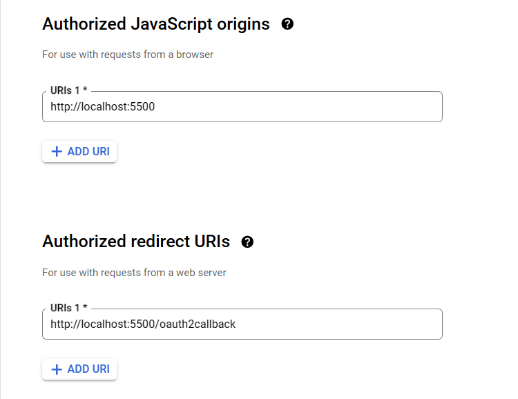

## Steps to set this up locally

1. First follow the steps in the Google Developers Guide [here](https://developers.google.com/gmail/api/quickstart/nodejs)

2. (optional) You can add these urls when prompted or use your own



3. After downloading credentials.json, it should look like this -

```
{
  "web": {
    "client_id": YOUR_CLIENT_ID,
    "project_id": YOUR_PROJECT_ID,
    "auth_uri": "https://accounts.google.com/o/oauth2/auth",
    "token_uri": "https://oauth2.googleapis.com/token",
    "auth_provider_x509_cert_url": "https://www.googleapis.com/oauth2/v1/certs",
    "client_secret": YOUR_CLIENT_SECRET,
    "redirect_uris": ["http://localhost:5500/oauth2callback"],
    "javascript_origins": ["http://localhost:5500"]
  }
}
```

> Note: Remember to add your credentials. This won't work.

4. Now, fork this repository or clone it using

```
https://github.com/sohamtembhurne/autoMailer.git
```

5. Add `credentials.json` you downloaded in step 3 to the project directory

6. Now, perform the following steps to run the app

```
npm install
npm start
```

To start in development mode -

```
npm run dev
```
